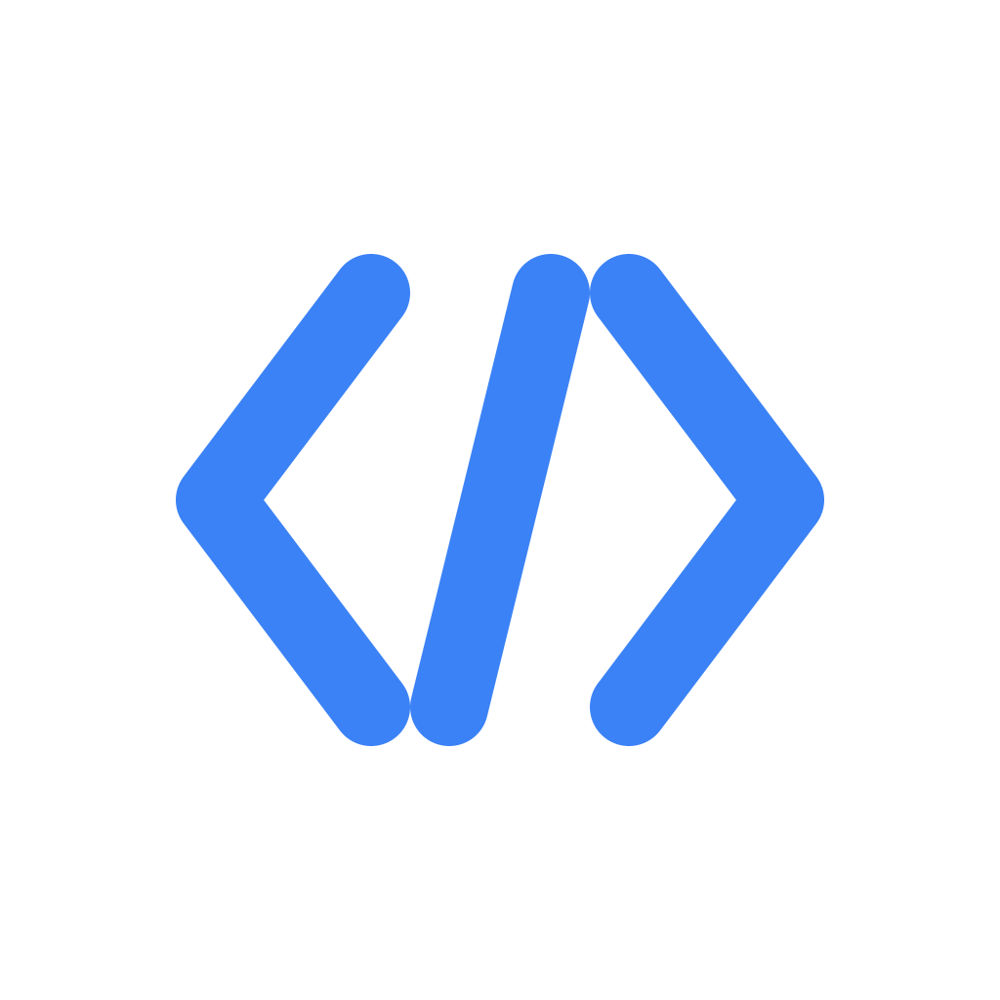

# Publisher

<div align="center">
  

  <h3>A Professional HTML Code Editor</h3>
  <p>Live preview • Tailwind CSS • 30+ Templates • Inspect Mode</p>

  
  
  
</div>

---

A modern, desktop HTML code editor built with Electron and Monaco Editor. Features 30+ production-ready templates, live preview, inspect mode, and intelligent code formatting. Built entirely through AI pair programming with Claude Code - documented on YouTube.

> 🎥 **Building in Public:** This editor was built as part of a YouTube series documenting AI-assisted development. [Watch the series →](https://www.youtube.com/@RogersTestLab)

## ✨ Features

### 🎯 Core Features
- **Live Preview** - See your HTML changes instantly in a side-by-side preview
- **Monaco Editor** - VS Code's powerful editor with syntax highlighting and IntelliSense
- **Tailwind CSS Support** - Built-in Tailwind CSS CDN for rapid styling
- **30+ Templates** - Ready-to-use templates for landing pages, components, forms, and more
- **Dark/Light Theme** - Comfortable editing experience in any lighting condition

### 🔧 Professional Tools
- **Inspect Mode** - Click any element in the preview to highlight its code in the editor
- **Code Formatting** - One-click HTML beautification with Prettier (Shift+Alt+F)
- **File Management** - Open, save, and export HTML files with ease
- **Recent Files** - Quick access to recently opened files
- **Template Panel** - Browse and insert templates with a single click (Ctrl+T)

### 🎨 User Experience
- **Customizable Font Size** - Adjust editor font size (10-24px)
- **Word & Character Count** - Real-time document statistics in toolbar
- **Line Numbers** - Synchronized line numbers with code highlighting
- **Status Bar** - Shows line count, character count, and language indicator
- **Keyboard Shortcuts** - Efficient workflow with keyboard commands
- **Auto-Save** - Never lose your work with automatic localStorage backup
- **Window Title** - Shows current filename with unsaved changes indicator (*)

### 📦 Template Library (30+ Templates)
- **Full Pages** - Landing Page, About Page, Contact Page
- **Hero Sections** - Hero, Split Hero, Centered Hero, Hero with Form
- **Components** - Button, Card, Form Input, Alert, Badge, Modal, Tabs
- **Forms** - Contact Form, Newsletter, Login
- **Content Blocks** - Feature Grid, Pricing, Testimonials, Team, CTA, Stats
- **Navigation & Layout** - Navbar, Footer, Sidebar

All templates use **Tailwind CSS** for modern, responsive styling.

---

## 📸 Screenshots

> **Note:** Screenshots will be added soon

### Main Interface
*Light and Dark themes with live preview*


### Template Browser
*Browse and insert 30+ pre-built templates*


### Inspect Mode
*Click any element in the preview to see its code*


### Code Formatting
*One-click HTML beautification*


---

## 🚀 Installation

### Download

Download the latest version for your platform from the [Releases](https://github.com/rogerstestlab/Publisher/releases/latest) page:

**Windows**
- `Publisher-1.0.0-win-x64.exe` - 64-bit installer
- `Publisher-1.0.0-win-ia32.exe` - 32-bit installer
- `Publisher-1.0.0-win-x64-portable.exe` - Portable (no installation)

**macOS**
- `Publisher-1.0.0-mac-x64.dmg` - Intel Macs
- `Publisher-1.0.0-mac-arm64.dmg` - Apple Silicon (M1/M2/M3)

**Linux**
- `Publisher-1.0.0-linux-x64.AppImage` - Universal (recommended)
- `Publisher-1.0.0-linux-x64.deb` - Debian/Ubuntu
- `Publisher-1.0.0-linux-x64.rpm` - Fedora/RHEL

### Windows Installation

1. Download the `.exe` installer for your architecture
2. Run the installer
3. Follow the installation wizard
4. Launch Publisher from the Start Menu or Desktop shortcut

### macOS Installation

1. Download the `.dmg` file for your Mac
2. Open the DMG file
3. Drag Publisher to the Applications folder
4. Launch from Applications
5. If prompted, allow the app in System Preferences → Security & Privacy

### Linux Installation

**AppImage (Recommended)**
```bash
# Download the AppImage
wget https://github.com/rogerstestlab/Publisher/releases/latest/download/Publisher-1.0.0-linux-x64.AppImage

# Make it executable
chmod +x Publisher-1.0.0-linux-x64.AppImage

# Run it
./Publisher-1.0.0-linux-x64.AppImage
```

**Debian/Ubuntu (DEB)**
```bash
# Download and install
wget https://github.com/rogerstestlab/Publisher/releases/latest/download/Publisher-1.0.0-linux-x64.deb
sudo dpkg -i Publisher-1.0.0-linux-x64.deb
```

**Fedora/RHEL (RPM)**
```bash
# Download and install
wget https://github.com/rogerstestlab/Publisher/releases/latest/download/Publisher-1.0.0-linux-x64.rpm
sudo rpm -i Publisher-1.0.0-linux-x64.rpm
```

---

## ⌨️ Keyboard Shortcuts

| Shortcut | Action |
|----------|--------|
| `Ctrl/Cmd + N` | New file |
| `Ctrl/Cmd + O` | Open file |
| `Ctrl/Cmd + S` | Save file |
| `Ctrl/Cmd + E` | Export HTML |
| `Ctrl/Cmd + T` | Toggle template panel |
| `Shift + Alt + F` | Format code |

---

## 💻 Tech Stack

- **Electron** - Cross-platform desktop app framework
- **React** - UI library
- **Monaco Editor** - VS Code's editor component
- **Vite** - Lightning-fast build tool
- **Tailwind CSS** - Utility-first CSS framework (CDN)
- **Prettier** - Automatic code formatting

---

## 🛠️ Development

### Getting Started

### Prerequisites
- Node.js v16 or higher
- npm or yarn

### Installation

```bash
# Clone the repository
git clone https://github.com/rogerstestlab/Publisher.git
cd Publisher

# Install dependencies
npm install
```

### Development

```bash
# Run in development mode (Vite + Electron)
npm run electron:dev

# Or run separately:
npm run dev        # Start Vite dev server
npm run electron   # Start Electron app
```

### Building

```bash
# Build for production
npm run build

# Package for all platforms
npm run package

# Or package for specific platforms:
npm run package:win      # Windows
npm run package:mac      # macOS
npm run package:linux    # Linux
```

Build artifacts will be saved to the `release/` directory.

## Project Structure

```
Publisher/
├── src/
│   ├── components/
│   │   ├── Editor.jsx          # Monaco editor wrapper
│   │   ├── Preview.jsx         # Live HTML preview (iframe)
│   │   ├── TemplatePanel.jsx   # 33-template library sidebar
│   │   ├── SplitPane.jsx       # Draggable divider
│   │   ├── Toolbar.jsx         # Top controls
│   │   └── Toast.jsx           # Notification system
│   ├── App.jsx                 # Root component & state
│   └── main.jsx                # React entry point
├── main.js                     # Electron main process
├── preload.js                  # Electron IPC bridge
└── package.json
```

## Built with AI Pair Programming

This entire editor was built using AI-assisted development with Claude Code. Every feature, bug fix, and architectural decision is documented on YouTube as part of the **"Building a Website Editor with Claude Code"** series on [Rogers Test Lab](https://www.youtube.com/@RogersTestLab).

**Why this matters:** This isn't just another code editor - it's a case study in how AI can accelerate real product development. The template library, formatting integration, and editor UX were all implemented through natural language prompts to Claude.

### YouTube Series Episodes

- **Episode 1-5**: Foundation setup, Monaco integration, template library expansion
- **More episodes coming weekly** - Subscribe to follow along!

[→ Watch the full series](https://www.youtube.com/@RogersTestLab)

---

## 📋 System Requirements

### Minimum Requirements
- **Windows**: Windows 10 or later (64-bit or 32-bit)
- **macOS**: macOS 10.13 (High Sierra) or later
- **Linux**: 64-bit distribution with GTK 3
- **RAM**: 4 GB
- **Disk Space**: 500 MB free
- **Display**: 1280x720 or higher

### Recommended
- 8 GB RAM or more
- Display resolution: 1920x1080 or higher
- SSD for faster app loading

---

## 🤝 Contributing

This is primarily an educational project for the YouTube series, but suggestions and issues are welcome! Feel free to:

- Open an issue for bugs or feature requests
- Submit PRs for improvements
- Share your feedback on YouTube

### Development Workflow

1. Fork the repository
2. Create a feature branch (`git checkout -b feature/AmazingFeature`)
3. Commit your changes (`git commit -m 'Add some AmazingFeature'`)
4. Push to the branch (`git push origin feature/AmazingFeature`)
5. Open a Pull Request

---

## 🐛 Bug Reports & Support

Found a bug or need help?

- **Bug Reports**: [Open an issue](https://github.com/rogerstestlab/Publisher/issues/new?labels=bug)
- **Feature Requests**: [Request a feature](https://github.com/rogerstestlab/Publisher/issues/new?labels=enhancement)
- **Email**: rogerstestlab@gmail.com
- **YouTube**: Ask questions in the video comments

---

## 📌 Roadmap

Future enhancements planned:

- [ ] Search & Replace (Ctrl+F)
- [ ] Multi-tab support
- [ ] Settings panel (theme colors, editor preferences)
- [ ] Custom template creation and management
- [ ] Multi-file projects with file tree
- [ ] Git integration
- [ ] Auto-update functionality
- [ ] Export to PDF
- [ ] Code snippets library

---

## License

This project is licensed under the MIT License - see the [LICENSE](LICENSE) file for details.

---

## 🙏 Acknowledgments

- **Claude Code** by Anthropic - AI pair programming assistant used to build this entire application
- **Monaco Editor** by Microsoft - The powerful code editor component
- **Tailwind CSS** by Tailwind Labs - Modern CSS framework for templates
- **Prettier** - Code formatting engine
- **Electron** team - For making cross-platform desktop apps possible

---

## 🔗 Links

- **YouTube Channel**: [Rogers Test Lab](https://www.youtube.com/@RogersTestLab)
- **GitHub Repository**: [rogerstestlab/Publisher](https://github.com/rogerstestlab/Publisher)
- **Download**: [Latest Release](https://github.com/rogerstestlab/Publisher/releases/latest)
- **Report Issues**: [Issue Tracker](https://github.com/rogerstestlab/Publisher/issues)

---

<div align="center">
  <p>Made with ❤️ by Roger</p>
  <p>Built entirely with AI pair programming using Claude Code</p>

  [Download](https://github.com/rogerstestlab/Publisher/releases) • [Report Bug](https://github.com/rogerstestlab/Publisher/issues) • [Watch on YouTube](https://www.youtube.com/@RogersTestLab)
</div>
